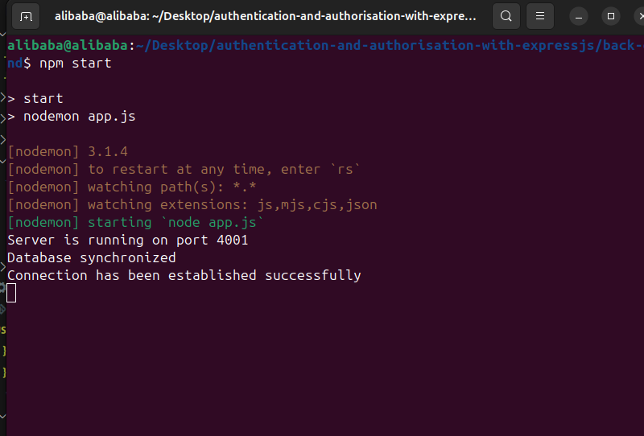
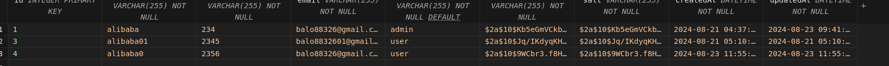
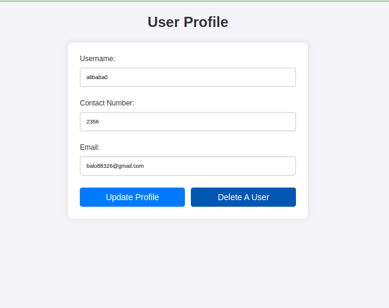
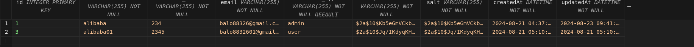

<h1 align="center">Authentication and Authorisation with Expressjs</h1>

<div align="center">

[]()
[](https://github.com/alibaba0010/authentication-and-authorisation-with-expressjs/issues)
[](https://github.com/kylelobo/The-Documentation-Compendium/pulls)
[](/LICENSE)

</div>

---

<p align="center"> This a StackUp Bounty Project on Authentication and Authorisation with Expressjs Project.
    <br> 
</p>

## 📝 Table of Contents

- [Getting Started](#getting_started)
- [Deployment](#deployment)
- [Usage](#usage)
- [Built Using](#built_using)
- [TODO](../TODO.md)
- [Contributing](../CONTRIBUTING.md)
- [Authors](#authors)
- [Acknowledgments](#acknowledgement)

## 🏁 Getting Started <a name = "getting_started"></a>

These instructions will get you a copy of the project up and running on your local machine for development and testing purposes. See [deployment](#deployment) for notes on how to deploy the project on a live system.

### Prerequisites

What things you need to install the software and how to install them.

```
1. Ensure you have Node.js installed.
2. cd into backund folder
3. Install the packages using npm install
4. install SQLite3 Editor and Live Server extensions in your code editor
```



<h4 align="center">Server running</h4>

## The Delete User Functionality







## ✍️ Authors <a name = "authors"></a>

- [@alibaba](https://github.com/alibaba0010) - Idea & Initial work

## 🎉 Acknowledgements <a name = "acknowledgement"></a>

- [Stackup](https://stackup.dev/)
